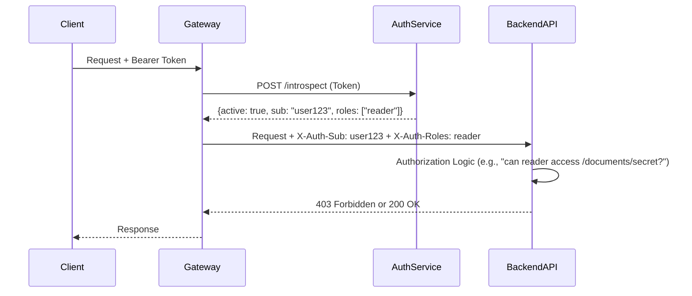

# Metadata

* **Document ID:** CORE-BACKEND-001
* **Version:** 1.1.0
* **Category:** Backend Engineering
* **Status:** Draft
* **Dependencies:** CORE-ARCH-001, CORE-CONTEXT-001, CORE-QUALITY-001
* **Scope:** APIs, Server Architecture, Databases, Authentication, Authorization, Security, Caching, Queues, Microservices, Scalability, Performance, DevOps Integration, Monitoring, Logging, Testing, Rate Limiting, Background Jobs, Configuration & Secrets, File Storage, Real-time Communication, Multi-Tenancy, Data Privacy & Compliance, Payments & Billing, Search Engineering, Enterprise Backend Engineering
* **Last Updated:** 2026-07-30

---

# Identity & Purpose

## Mission
To define the complete, authoritative specification for designing, building, deploying, and operating backend systems that are scalable, resilient, secure, observable, and maintainable within the AI-WEOS ecosystem.

## Primary Objective
Establish a single source of truth that transforms backend engineering from an art of subjective preference into a discipline of reasoned trade-offs, grounded in first principles and operational excellence.

## Scope
* API Design and Lifecycle Management (REST, GraphQL, gRPC).
* Server-side architecture patterns (Monolithic, Modular Monolith, Microservices, Serverless).
* Data persistence strategies (Relational, NoSQL, Event Sourcing).
* Authentication and Authorization frameworks (OAuth 2.0, JWT, RBAC, ABAC).
* Defensive security engineering (Input validation, Cryptography, Threat modeling).
* Caching topologies and invalidation strategies.
* Asynchronous processing via message queues and event streams.
* Scalability models (Vertical, Horizontal, Sharding, Partitioning).
* Performance optimization (Query tuning, Connection pooling, Resource management).
* DevOps integration (CI/CD pipelines, IaC, Containerization).
* Observability triad (Metrics, Logs, Traces) and alerting.
* Enterprise operational workflows (Incident response, Capacity planning, DR).

## Out of Scope
* Frontend rendering logic, CSS, or browser-specific APIs.
* Mobile application development frameworks.
* Specific vendor product manuals or step-by-step UI walkthroughs.
* Physical data center hardware specification or procurement.
* Detailed network transport layer protocols below the application layer (e.g., BGP, OSPF).

## Engineering Philosophy
1. **Data is the Absolute Source of Truth:** The database is the system. Application servers are ephemeral caches and transformation layers. The integrity, durability, and consistency of persisted state is the paramount concern.
2. **Simplicity is a Prerequisite for Reliability:** Complexity is the enemy of uptime. Justify every abstraction, dependency, and architectural decision with a clear operational need. A monolith that solves the business problem is superior to a microservice mesh that introduces inter-service entropy.
3. **Explicit Contracts over Implicit Behavior:** All inter-component communication (service-to-service, client-to-server) must be defined by strict, versioned, and machine-validatable contracts. Schema-first development is mandatory.
4. **Operational Readiness is a Feature:** A feature is not complete until it is monitored, logged, alerted, and documented. The "Run Book" is as important as the source code.
5. **Failure is a Design Constraint:** Design for the fallback, not just the happy path. Systems *will* fail; the engineering quality is defined by how gracefully and predictably the system degrades under partial failure.

## Engineering Mindset
* **Pessimistic Optimist:** Write code as if the network will partition, the third-party API will timeout, the database will deadlock, and the next engineer to touch this code will not read the documentation. Plan for those constraints, but build with the optimism that the system will scale.
* **Pragmatism over Purity:** A messy, well-understood solution that ships today and can be refactored is better than a perfectly architected solution that ships next year. Technical debt is a financial instrument; take it on deliberately, with a repayment plan.
* **System Thinker:** Understand the n-squared impacts. A change in a database index affects query performance, write amplification, replication lag, and storage cost. Always traverse the impact tree.

## Core Principles
* **Stateless Compute, Stateful Data:** Application servers must hold no session state. State belongs exclusively in durable storage (databases) and caches (treated as ephemeral performance layers, not sources of truth).
* **Defense in Depth:** Security is not a perimeter. Validate at the edge (API Gateway), at the service boundary, and at the data access layer. Never trust upstream data.
* **Automated Immutability:** Server infrastructure is never updated; it is replaced. Deployment is the act of tearing down a previous version of an artifact and instantiating a new one.
* **Observable by Default:** Every service must emit standardized structured logs, dimensional metrics, and distributed traces on every significant request path without requiring configuration changes.

## First Principles
1. **Request-Response Loop:** A backend system is fundamentally a function `f(Request, State) -> Response, NewState`. All architecture is an organization scheme for this function.
2. **CAP Theorem Constraints:** In a network partition (P), a distributed data store must choose between Consistency (C) and Availability (A). The entire system's behavior is determined by this singular physical constraint. *"Consistency" here means linearizability, not eventual consistency.*
3. **Amdahl's Law for Scalability:** The maximum speedup of a task is limited by its non-parallelizable portion. For systems, this means the serialized bottleneck (e.g., a single database write lock) will become the absolute ceiling, regardless of compute scale-out.
4. **Little's Law for Performance:** `L = λ * W`. The average number of in-flight requests (L) equals the arrival rate (λ) multiplied by the average latency (W). To reduce concurrency under load, reduce latency, not add threads.
5. **Fallacies of Distributed Computing:** The network is not reliable, latency is not zero, bandwidth is not infinite, the network is not secure, topology does not change, there is one administrator, transport cost is not zero, and the network is not homogeneous. These are not "unexpected edge cases"; they are the expected operating environment.

---

# Foundations

## 1. The Request Lifecycle

### Definition
The complete, end-to-end journey of a single external user request through the backend system, from the initial network packet to the final response payload and any resulting asynchronous side-effects.

### Purpose
To establish a shared mental model for tracing, debugging, performance optimization, and security auditing. Every engineer must be able to map any line of backend code to its position in this lifecycle.

### Why it exists
Without a canonical lifecycle model, reasoning about system behavior becomes fragmented. A 500 error or a latency spike cannot be effectively diagnosed without understanding the exact sequence of state transitions a request undergoes.

### Mental Model
A request is a "digital train" passing through a series of "signal stations" (middleware, handlers, data access layers). Each station can inspect, enrich, reject, or dispatch the train. The train carries a "black box" (the trace context) that records its journey.

### Relationship with other concepts
* **Middleware Chaining:** The implementation of the request pipeline.
* **Distributed Tracing:** The observability mechanism to visualize the lifecycle across services.
* **Resilience Patterns:** Timeouts, retries, and circuit breakers are lifecycle timeout and detour controllers.

### Trade-offs
* **Centralized Pipeline (Gateway/Mesh):** Simpler service code, but the pipeline becomes a critical single point of failure and a potential bottleneck.
* **De-centralized Pipeline (Library-based):** More resilience, but risk of inconsistent enforcement (e.g., a service forgetting to validate an auth token).

### Common misunderstandings
* "The lifecycle starts at the application code." **Reality:** It starts at the TCP handshake. TLS termination, load balancer routing, and WAF inspection are critical lifecycle stages.
* "A request is a single thread." **Reality:** In asynchronous, event-driven architectures, a single request may be multiplexed across multiple fibers/threads/coroutines, making stack traces misleading.

## 2. Idempotency

### Definition
A property of an operation where multiple identical invocations produce the same side-effects as a single invocation.

### Purpose
The fundamental building block of safe retries, fault-tolerance, and exactly-once processing semantics in an unreliable network.

### Why it exists
Networks fail. The only safe way to handle a `TimeoutError` from a payment gateway is to retry the request. Without idempotency, retries lead to double charges. Idempotency turns an impossible distributed systems problem into a tractable one.

### Mental Model
An idempotency key is a unique promise. The system receives the promise and the payload. If it has seen the promise before, it ignores the payload and returns the cached result of the original promise fulfillment.

### Relationship with other concepts
* **Database Transactions:** Idempotency keys are often stored in a database alongside the operation's result, atomically using a unique constraint on the key.
* **Message Queues:** At-least-once delivery semantics mandate idempotent consumers.

### Trade-offs
* **Key Lifecycle:** Storing idempotency keys indefinitely is costly. Pruning keys based on a time-to-live (TTL) is necessary, creating a trade-off between storage cost and the safety window for retries.
* **Complexity:** Retro-fitting idempotency onto an existing non-idempotent system is significantly more complex than designing for it from the start.

### Common misunderstandings
* "Idempotency means the response body is always identical." **Reality:** It means the side-effects are identical. A `GET` request is idempotent, but the response body can change over time. A banking transfer operation is idempotent (the transfer happens once), but the bank balance response will reflect that change.

## 3. Back-Pressure

### Definition
A feedback mechanism that allows a downstream service or component to signal to an upstream one that it is overwhelmed, causing the upstream to slow down or buffer the flow of requests.

### Purpose
Prevents catastrophic "fail-by-overload" scenarios. Without back-pressure, a slow downstream can cause requests to queue indefinitely upstream, exhausting memory, threads, and file descriptors, leading to a cascading crash.

### Why it exists
Every system component has a finite capacity. Back-pressure is the safety valve that respects that limit, trading rapid failure (load-shedding) for graceful degradation under excessive load.

### Mental Model
A pipe system. If the outlet pipe is narrowed, you must reduce the inlet flow, or the pipe will burst. TCP flow control is a physical-world instantiation of this principle at the network level.

### Relationship with other concepts
* **Reactive Streams:** The formal API specification (e.g., RSocket, Project Reactor) for asynchronous stream processing with non-blocking back-pressure.
* **Queue Theory:** A full queue is a passive form of back-pressure (it will eventually block the producer or crash). Explicit back-pressure is active (it signals the producer before the queue is full).
* **Load Shedding:** The active decision to reject new work when back-pressure fails or is too slow to react.

### Trade-offs
* **Latency vs. Reliability:** Applying back-pressure increases the latency of the queued requests but preserves overall system reliability. The alternative is immediate failure (low latency but poor user experience).
* **Implementation Complexity:** True, end-to-end back-pressure from a web client (e.g., via HTTP/2 flow control) to a database connection pool is extremely difficult to achieve and rarely implemented fully.

---

# Complete Knowledge Base

## Module 1: API Design & Lifecycle Management

### Definition
The discipline of defining, versioning, documenting, and retiring programmatic interfaces between system components.

### Architecture
* **API Gateway Pattern:** A single-entry point that handles cross-cutting concerns (TLS termination, auth, rate-limiting, request transformation) and routes to backend services. Variants: Edge Gateway (internet-facing) and Internal Gateway (service mesh ingress).
* **Backend for Frontend (BFF):** A dedicated API layer for a specific UI, optimizing data shape and aggregation for that UI's unique needs. Sacrifices API generality for UI performance and simplicity.

### Workflow
1. **Contract Definition:** Write the specification first (OpenAPI 3.x for REST, GraphQL SDL for GraphQL, `.proto` files for gRPC). This is a collaborative artifact reviewed by consumers.
2. **Mock Generation:** Generate mock servers from the spec to enable client and server development in parallel.
3. **Implementation:** Build the server-side logic against the generated interface stubs.
4. **Compatibility Testing:** Validate new implementation against old client contracts to prevent regressions.
5. **Gateway Configuration:** Map the API route, apply security policies, and configure rate limits.
6. **Deploy & Version:** Deploy and register the new API version with the service registry.
7. **Deprecation & Sunset:** Announce deprecation. Track usage. Maintain the version for the specified deprecation period, then remove the route.

### Patterns
* **Request-Response:** Standard synchronous API.
* **Resource-Polling:** Client repeatedly checks a status endpoint for an asynchronous operation. Simple but inefficient.
* **Webhook/Callback:** Client provides a URL; the server `POST`s the result when ready. The server becomes the client.
* **Server-Sent Events (SSE):** A unidirectional stream from server to client over HTTP.
* **Pagination (Cursor-based):** The only correct pagination method for mutable, real-time data sets. An opaque pointer to a specific record in a sorted data set, resilient to insertions/deletions.

### Decision Framework
* **When to use REST:** Broad, general-purpose internal and external APIs where cacheability and a large ecosystem of tooling are paramount.
* **When to use GraphQL:** When facing a complex UI data graph, high-latency mobile clients, or many disparate consumers who need different data shapes from the same domain. The primary cost is the N+1 query problem and cache complexity.
* **When to use gRPC:** High-performance, low-latency internal service-to-service communication, especially in polyglot environments and streaming use cases.
* **When to use Async/Event-Driven:** When the operation is long-running, has no immediate result requirement, or is a side-effect triggered by a state change (e.g., "Send email after order is placed").

### Anti-Patterns
* **Leaky Abstraction:** Exposing database table structures or internal identifiers directly in API responses.
* **Big Ball of Mud API:** A single, monolithic API that aggregates all domains, becoming a development bottleneck.
* **Version in URL as a String:** `POST /v1/orders` is fine for coarse versioning, but `v1.2.3` is an anti-pattern. API versions should not map directly to internal builds.

### Checklist
- [ ] Is the API contract defined in a spec-first manner?
- [ ] Are all identifiers opaque (ULIDs or UUIDv7) not auto-incrementing integers?
- [ ] Is pagination cursor-based where data sets are mutable?
- [ ] Are error responses standardized (e.g., RFC 7807 Problem Details)?
- [ ] Is the deprecation policy defined and communicated via `Sunset` HTTP headers?

---

## Module 2: Data Persistence & Modeling

### Definition
The engineering of how system state is structured, stored, queried, and mutated over time.

### Architecture
* **Write Model (Command):** Optimized for data integrity and business rule enforcement. Handles `CREATE`, `UPDATE`, `DELETE` operations. Often uses normalized relational models.
* **Read Model (Query):** Optimized for specific query patterns and read performance. Often uses denormalized, pre-joined data structures, materialized views, or specialized search indexes (Elasticsearch). CQRS formally separates these models.

### Workflow (Database Migration)
1. **Declarative State:** State the desired final schema (tables, columns, indexes).
2. **Diff Generation:** Tooling compares the desired state against the live database state and generates the migration script.
3. **Safety Review:** Manually review the generated script for destructive operations (`DROP COLUMN`, `RENAME TABLE`) and lock acquisition.
4. **Zero-Downtime Deployment:** Execute multi-phase migrations.
   * *Phase 1: Expand.* Add new table/column. App code writes to both old and new column.
   * *Phase 2: Backfill.* Asynchronously populate new column for existing rows.
   * *Phase 3: Migrate.* App code reads from new column, writes only to new column.
   * *Phase 4: Contract.* Drop old column.
5. **Rollback:** The expand phase must have a direct, safe rollback. The contract phase is irreversible without a restore.

### Transaction Isolation Levels
| Isolation Level | Dirty Read | Non-repeatable Read | Phantom Read | Mental Model |
| :--- | :---: | :---: | :---: | :--- |
| Read Uncommitted | Possible | Possible | Possible | No transactions. Chaos. |
| Read Committed | Not Possible | Possible | Possible | See only committed data at query time. Default for many DBs. |
| Repeatable Read | Not Possible | Not Possible | Possible | Snapshot at transaction start. Query it twice, get same rows. |
| Serializable | Not Possible | Not Possible | Not Possible | Transactions execute as if sequentially. Gold standard, high cost. |

### Anti-Patterns
* **Entity-Attribute-Value (EAV):** A generic table structure (`entity_id`, `attribute`, `value`) that destroys data type integrity, query performance, and relational constraints. Exception: Highly specialized metadata indexing systems.
* **God Table:** A table with hundreds of columns representing multiple entities. A maintenance nightmare and a performance bottleneck due to row churn.
* **Direct External Database Access:** Exposing the database to an external client (e.g., a mobile app) via a connection string. Bypasses all API-level security, logic, and throttling.

### Checklist
- [ ] Can the chosen database model satisfy the system's consistency requirements under a network partition (CAP theorem)?
- [ ] Is the migration strategy zero-downtime compatible (Expand-Contract)?
- [ ] Are connection strings, credentials, and read-write permissions managed as secrets, not config?
- [ ] Are N+1 query problems detected and mitigated in the data access layer?

---

## Module 3: Authentication & Authorization (Auth-N / Auth-Z)

### Definition
* **Authentication (Auth-N):** The process of verifying the identity of a principal (user, service).
* **Authorization (Auth-Z):** The process of determining what an authenticated principal is allowed to do.

### Architecture

The architecture separates concerns: The Gateway handles Auth-N validation and propagation. The Backend Service handles Auth-Z enforcement based on its domain logic.

### Core Protocol: OAuth 2.0 & OIDC
* **Authorization Code Flow + PKCE:** The only secure flow for server-side and modern single-page applications. PKCE (Proof Key for Code Exchange) binds the authorization code to the original requester, preventing authorization code injection attacks. The Implicit Flow is deprecated.
* **Client Credentials Flow:** Used for service-to-service communication. No user is involved.

### Token Strategy: JWT vs. Opaque
* **JWTs (JSON Web Tokens):** Self-contained, cryptographically signed claims. Enables stateless, decentralized validation (great for performance). The trade-off is that they cannot be easily revoked before expiry; this requires a token revocation list (TRL) or short-lived tokens (15 mins) paired with refresh tokens.
* **Opaque Tokens:** A random string that must be introspected at an Authorization Server on every request. Enables instant revocation but adds latency and couples the availability of the service to the Auth Server.

### Authorization Models
* **RBAC (Role-Based Access Control):** Permissions are grouped into roles, and roles are assigned to users. Good for coarse-grained access. Explodes in complexity for fine-grained control ("role explosion").
* **ABAC (Attribute-Based Access Control):** Access is granted based on attributes of the user, the resource, the action, and the environment. Policy language (e.g., OPA's Rego, Cedar) is used to evaluate `if user.division == resource.division AND action == "read"`. This is the only scalable model for fine-grained, enterprise authorization.
* **ReBAC (Relationship-Based Access Control):** Authorization is based on the relationship between the subject and the resource in a graph (e.g., Google Zanzibar). "Is user X a `viewer` of document Y?". Ideal for social networks, content platforms, and hierarchical permissions.

### Common Misunderstandings & Anti-Patterns
* **JWT as a Session Cookie:** Storing a JWT in a non-`HttpOnly` cookie or `localStorage` exposes it to XSS attacks. JWTs for user identity should be delivered as `HttpOnly`, `Secure`, `SameSite=Strict` cookies or memory variables, not local storage.
* **Home-grown Cryptography:** Never implement a custom signing algorithm, token format, or encryption scheme. Use battle-tested libraries and standard protocols.
* **Authorization in the Gateway:** The Gateway should *authenticate* and propagate claims, but not perform complex domain-specific authorization. That logic belongs in the service that owns the data.

### Checklist
- [ ] Is PKCE used for all OAuth 2.0 authorization code grants?
- [ ] Are access tokens short-lived (e.g., 15 minutes)?
- [ ] Is all inter-service Auth-N using a strict mTLS + service account token (SPIFFE/SPIRE) model?
- [ ] Is Auth-Z modeled as a decoupled policy decision point (e.g., OPA) or a dedicated service?
- [ ] Is "Decide once, enforce everywhere" a core principle?

---

## Module 4: Security Engineering

### Definition
The holistic, non-functional discipline of protecting data confidentiality, integrity, and availability (CIA) at every layer of the system.

### Architecture: The Defensive Mesh
Security is not a single box on an architecture diagram. It's a mesh that touches every component.
* **Edge:** DDoS Mitigation, Web Application Firewall (WAF), TLS 1.3.
* **Gateway:** Rate Limiting, JWT Signature Validation, Request Size Capping.
* **Service:** Input Validation, Output Encoding, Context-Aware Authorization.
* **Data:** Encryption at Rest, Database Access Controls, Dynamic Data Masking.

### Key Practices
* **Threat Modeling:** A structured process to identify potential threats (e.g., STRIDE), assess their risk (e.g., DREAD), and define mitigations. Must be performed for every new major feature. The output is a live document, not a one-time compliance checkbox.
* **Input Validation:** The first and most critical line of defense.
  * *Design: Positive Validation.* Define what is allowed (e.g., a regex for a valid Unicode name) and reject everything else. Never use "deny lists" for new patterns.
  * *Engineering:* Validate at the boundary. Once a value is cleaned and validated, it should be stored in a domain type (e.g., `EmailAddress`, `UserId`) that makes it impossible to use an unvalidated string downstream.
* **Secrets Management:** Secrets (API keys, DB passwords, private keys) must never be in source code, environment variables in a bare OS process, or config files. They must be fetched from a secret store (e.g., HashiCorp Vault) at runtime, delivered via an encrypted channel, and mounted into the application container's memory as a tempfs file. Secrets must be rotated without redeployment.

### Anti-Patterns
* **Security by Obscurity:** Relying on hiding an API endpoint or using a non-standard algorithm for protection.
* **Trusting the Upstream:** Assuming a backend service's caller has performed all necessary security checks. Every service must re-validate auth and authorization for its own data.
* **Logging Sensitive Data:** Logging full JWT tokens, API keys, passwords, or credit card numbers. These should be masked or hashed with a stable hash for debugging.

---

## Module 5: Caching Strategies

### Definition
A technique for storing a copy of data in a temporarily high-performance layer (the cache) to serve future requests faster, reducing load on the primary source of truth.

### Cache Topologies
| Pattern | Data Flow | Pros | Cons | Use Case |
| :--- | :--- | :--- | :--- | :--- |
| **Cache-Aside (Lazy)** | App checks cache. On miss, App fetches from DB & writes to cache. | Resilient to cache failures. Easy to implement. | Cache is not fresh by default. First-read penalty. | General-purpose, read-heavy data. |
| **Read-Through** | App reads from Cache. Cache fetches from DB on miss. | Simplifies app code. | Cache is a single point of failure for fetching. Tight coupling. | When you have a stable, custom cache layer. |
| **Write-Through** | App writes to Cache. Cache synchronously writes to DB. | Data in cache is never stale. | Highest write latency. Unnecessary for data that is not read. | Scenarios demanding strict consistency for reads. |
| **Write-Behind** | App writes to Cache. Cache asynchronously writes to DB. | Lowest write latency. | Risk of data loss if cache fails before DB flush. | High-volume, non-critical data ingestion. |

### The Two Hard Problems
1. **Cache Invalidation:** The act of removing or updating stale data. Strategies:
   * *TTL (Time-to-Live):* Simple but produces a stale window. Suitable for degrading accuracy gracefully.
   * *Event-Driven Invalidation:* The source of truth publishes a `DataChanged` event. Caches subscribe and evict. The most robust, eventually consistent model.
   * *Write-Through:* solves it by never letting the cache get stale.
2. **Cache Key Design:** A key must be deterministic, uniformly distributed, and specific. Pattern: `{Domain}:{Entity}:{SubId}`. Example: `user:profile:12345`, `inventory:sku:ABC-123`.

### Anti-Patterns
* **Caching Everything by Default:** Premature optimization that introduces consistency problems and operational complexity. Cache only after measuring a performance problem.
* **Using a Cache as the Source of Truth:** The database is the source of truth. A cache is an ephemeral performance tool. Design the system to function (degradedly) if the cache is wiped cold.

---

## Module 6: Asynchronous Processing & Messaging

### Definition
The decoupling of a request's acceptance from its processing via a durable intermediary called a message broker or event log.

### Architecture Pattern: Message Queue vs. Event Stream
| Feature | Message Queue (e.g., RabbitMQ) | Event Stream (e.g., Kafka) |
| :--- | :--- | :--- |
| **Mental Model** | A task dispatcher. "Do this thing." | A distributed log. "A thing happened." |
| **Consumption** | Destructive. Message is removed after one consumer processes it. | Non-destructive. Consumers maintain their own offset/pointer. |
| **Primary Use Case** | Command Dispatching, Job Queueing. | Event Sourcing, Real-time Analytics, Data Integration (CDC). |
| **Message Ordering** | Per-queue FIFO (with nuances). | Strict per-partition order guarantee. |

### Safety Guarantees
* **At-most-once delivery:** The message is delivered once or not at all. Simplest, least reliable.
* **At-least-once delivery:** The message is delivered, but may be duplicated. **This is the default for most production systems.** Mandates consumer idempotency.
* **Exactly-once delivery:** The Holy Grail. Practically impossible end-to-end in a distributed system without strong coordination. Often approximated with idempotent producers + idempotent consumers + transactional read-write.

### Workflow: Outbox Pattern
The only safe way to atomically update a database and send a message.
1. The service writing to the database also inserts a record into an `outbox` table, all within a single local transaction.
2. A separate, low-latency poller process (e.g., Debezium) tails the `outbox` table.
3. The poller publishes the event to the message broker.
4. Upon successful publication, the poller marks the outbox record as sent.

*This pattern guarantees at-least-once publication without 2-phase commit (2PC).*

### Checklist
- [ ] Is message consumption idempotent?
- [ ] Are all dead-letter queues (DLQs) monitored and alerted on?
- [ ] Is the outbox pattern used for any operation that requires both a DB write and an event publish?
- [ ] Is message ordering enforced at the partition key level for commands requiring serializability?

---

## Module 7: Scalability & Performance

### Definition
* **Scalability:** The system's ability to handle growing amounts of work by adding resources.
* **Performance:** The system's efficiency in using those resources to process a single unit of work (latency, throughput).

### The Scale Cube (3 Dimensions of Scaling)
1. **X-Axis: Horizontal Duplication:** Clone the entire stateless service behind a load balancer. Solves compute-bound problems. Bottleneck moves to the database.
2. **Y-Axis: Functional Decomposition:** Split the monolith into services based on function or bounded context (Microservices). Solves development scaling and team coupling.
3. **Z-Axis: Data Partitioning (Sharding):** Split the data into multiple identical databases based on a partition key (e.g., `tenant_id`, `user_id` modulo N). The ultimate solution for data-bound scaling. Every query must now include the shard key. Loses cross-shard ACID transactions.

### Performance Anti-Patterns & Fixes
* **N+1 Query Problem:** One query to get a list of items, then N queries to get related data for each item.
  * *Fix:* Use a `JOIN` in SQL or a batch-loading utility (e.g., Facebook's DataLoader).
* **Thundering Herd:** A cache value expires, and a flood of concurrent requests simultaneously hit the database to repopulate it.
  * *Fix:* External recomputation (a cron job rewrites the cache) or probabilistic early expiration.
* **Head-of-Line Blocking:** A single slow request blocks the processing of all subsequent requests sharing the same thread/connection.
  * *Fix:* Use non-blocking, event-driven architectures or dedicated thread pools for different request types with circuit breakers.

---

## Module 8: Observability Engineering

### Definition
The property of a system to allow its internal state to be inferred from external outputs. The triad is **Metrics, Logs, and Traces**.

### The Pillars
1. **Metrics:** Aggregated, numeric measurements over a time window (e.g., P99 request latency, CPU utilization). Used for automated alerting and trend analysis.
   * *Use Case:* "Is the system operating within SLO?"
   * *Golden Signals (Google SRE):* Latency, Traffic, Errors, Saturation.
2. **Logs:** Immutable, timestamped, structured (JSON) records of discrete events. Used for debugging and forensic analysis.
   * *Best Practice:* Log a single, rich event per request span (e.g., "order_created") rather than multiple narrative lines. Include a `trace_id`.
3. **Traces:** A directed acyclic graph (DAG) of spans representing a single transaction's path through a distributed system.
   * *Use Case:* "Exactly where in the `POST /checkout` call tree did the 5-second latency spike occur?"

### Implementation: The Collection Pipeline
**Service → Agent (e.g., OpenTelemetry Collector) → Transport → Backend (e.g., Jaeger, Prometheus, Grafana Loki).**

OpenTelemetry is the vendor-neutral, CNCF standard. Instrumentation must be a shared library, with context propagation (W3C Trace Context) happening at the middleware level automatically.

---

## Module 9: Testing Engineering

### Definition
The discipline of proving backend correctness through automated, repeatable verification at multiple layers, rather than manual inspection.

### The Backend Testing Pyramid
| Layer | Scope | Speed | Example |
| :--- | :--- | :--- | :--- |
| **Unit** | A single function/class in isolation, all dependencies mocked. | Milliseconds | Testing a pricing calculation function. |
| **Integration** | A service against a real (or containerized) dependency — DB, cache, queue. | Seconds | Testing a repository layer against a real Postgres via Testcontainers. |
| **Contract** | Verifies a producer's API output matches what a consumer expects, without spinning up the consumer. | Seconds | Pact/consumer-driven contract tests between two services. |
| **End-to-End** | Full request through the real deployed system boundary. | Minutes | Hitting a staging API and asserting the full checkout flow. |
| **Load/Stress** | System behavior under expected and extreme concurrent load. | Minutes-Hours | k6/Gatling script simulating 10,000 concurrent checkouts. |

### Core Principles
* **Test the contract, not the implementation.** Tests should survive a refactor of internal logic if the external behavior is unchanged.
* **Idempotent test data.** Every test creates and tears down its own data; tests must never depend on execution order or shared mutable fixtures.
* **Deterministic time and randomness.** Inject clocks and random seeds; never let a test's pass/fail depend on wall-clock time.

### Anti-Patterns
* **The Ice Cream Cone:** Mostly E2E tests, few unit tests. Slow, flaky, expensive feedback loop.
* **Mocking the database in integration tests:** Defeats the purpose — use a real (containerized) instance to catch actual query/schema bugs.

### Checklist
- [ ] Does every new endpoint have at least one unit and one integration test?
- [ ] Are contract tests in place for any service-to-service dependency?
- [ ] Is a load test defined for any endpoint expected to handle >100 req/s?

---

## Module 10: Rate Limiting & Throttling

### Definition
Controlling the rate at which a client (user, API key, IP, or service) can consume a resource, to protect system stability and enforce fair usage or billing tiers.

### Algorithms
| Algorithm | Mechanism | Trade-off |
| :--- | :--- | :--- |
| **Fixed Window** | Count requests in a fixed time bucket (e.g., per minute). | Simple, but allows a burst of 2x limit at window boundaries. |
| **Sliding Window Log** | Track exact timestamp of every request. | Perfectly accurate, but memory-expensive at scale. |
| **Sliding Window Counter** | Weighted average of current and previous fixed windows. | Good accuracy/memory trade-off; the practical default. |
| **Token Bucket** | Tokens refill at a fixed rate; each request consumes one. | Allows controlled bursts up to bucket size. Industry standard for APIs. |
| **Leaky Bucket** | Requests queue and are processed at a constant output rate. | Smooths bursts completely; adds latency under load. |

### Where to Enforce
* **Edge/Gateway level:** Protects the whole system from abuse (IP-based, coarse).
* **Per-API-key/tenant level:** Enforces business/billing tiers (e.g., Free = 100 req/day).
* **Per-endpoint level:** Protects specific expensive operations (e.g., search, report generation) independent of the global quota.

### Required Behavior
* Always return `429 Too Many Requests` with a `Retry-After` header.
* Expose remaining quota via `X-RateLimit-Remaining` / `X-RateLimit-Reset` headers so well-behaved clients can self-throttle.

---

## Module 11: Background Jobs & Scheduling

### Definition
Work that executes outside the request-response cycle, either on a recurring schedule (cron-like) or deferred from a triggering event, distinct from durable event-driven messaging (Module 6) which is about inter-service communication.

### Job Categories
* **Scheduled/Cron Jobs:** Run at fixed intervals regardless of external triggers (e.g., nightly report generation, subscription renewal checks).
* **Deferred Jobs:** Triggered by a request, but executed later to keep the request fast (e.g., "send welcome email" after signup).
* **Recurring-per-entity Jobs:** Scheduled relative to an entity's own timeline (e.g., "remind user 24h before their booking").

### Core Requirements
* **Exactly-once execution intent:** Use a distributed lock or leader election so a scheduled job doesn't run N times across N server replicas simultaneously.
* **Idempotent job handlers:** A retried job (after a crash mid-execution) must not double-charge, double-send, or double-write.
* **Dead job visibility:** A job that fails after all retries must land somewhere visible (DLQ or admin dashboard), never silently vanish.

### Anti-Patterns
* **Using `setTimeout`/in-memory schedulers for anything business-critical** — state is lost on restart/deploy.
* **Long-running jobs on the same process as the web server** — starves request-handling threads. Run workers as a separate deployable process.

---

## Module 12: Configuration & Secrets Management

### Definition
The discipline of externalizing environment-specific values (URLs, feature flags, credentials) from application code, and protecting sensitive values (API keys, DB passwords, signing keys) from exposure.

### The Twelve-Factor Config Principle
Configuration that varies between environments (dev/staging/prod) must live in the environment, never hardcoded or committed to source control — including in test fixtures or example files.

### Secrets Hierarchy
| Tier | Storage | Use Case |
| :--- | :--- | :--- |
| **Local dev** | `.env` file, git-ignored, `.env.example` committed as a template. | Individual developer machines. |
| **CI/CD** | Encrypted secrets store of the CI provider (e.g., GitHub Actions Secrets). | Build/deploy pipelines. |
| **Production** | Dedicated secrets manager (e.g., cloud provider's Secrets Manager, Vault). | Runtime credential injection, with rotation support. |

### Non-Negotiable Rules
* Secrets are never logged, even at debug level — mask before any log line is emitted.
* Secrets are rotated on a schedule and immediately upon suspected compromise or team member offboarding.
* Application code reads secrets from environment/injected config only — never constructs a secret value or has one as a literal default.

---

## Module 13: File & Object Storage

### Definition
Patterns for accepting, storing, transforming, and serving binary/unstructured data (images, videos, documents) that don't belong in a relational database.

### Core Pattern: Direct-to-Storage Upload
1. Client requests an upload from the backend.
2. Backend generates a short-lived, pre-signed URL pointing directly to object storage (e.g., S3-compatible bucket).
3. Client uploads the file directly to storage — **not** through the application server.
4. Storage triggers a webhook/event back to the backend to record metadata and start any post-processing (e.g., thumbnail generation, virus scan).

*Why:* Routing large binary payloads through the application server wastes compute, memory, and bandwidth on a stateless service that should stay lightweight.

### Serving Strategy
* Never serve files directly from the application server in production. Serve via CDN in front of the object store.
* Private/sensitive files: serve via short-lived signed URLs, never a permanently public bucket.

### Checklist
- [ ] Is file type/size validated before a pre-signed URL is issued (not just after upload)?
- [ ] Are uploaded files scanned or sandboxed before being trusted (e.g., malware scan on documents)?
- [ ] Is there a defined retention/cleanup policy for orphaned uploads (upload started but never confirmed)?

---

## Module 14: Real-time Communication

### Definition
Patterns for pushing data from server to client (or between clients via the server) without the client polling — required for chat, live notifications, live dashboards, collaborative editing.

### Technology Choices
| Technology | Direction | Use Case | Trade-off |
| :--- | :--- | :--- | :--- |
| **WebSockets** | Full-duplex | Chat, collaborative editing, gaming | Stateful connection; requires sticky sessions or a shared pub/sub layer across server replicas. |
| **Server-Sent Events (SSE)** | Server → Client only | Live notifications, live feeds, streaming AI responses | Simpler than WebSockets, works over plain HTTP, but no client-to-server channel on the same connection. |
| **Long Polling** | Simulated push | Fallback for environments blocking the above | Higher latency, higher server overhead; last-resort only. |
| **Pub/Sub Backplane** (e.g., Redis Pub/Sub) | N/A — infra layer | Fans out real-time events across multiple stateless server instances | Required the moment you run more than one server replica with WebSockets. |

### Core Requirement
Any real-time feature must assume multiple horizontally-scaled server instances from day one — a message published on Server A must reach a client connected to Server B via a shared backplane, not just an in-memory event emitter.

---

## Module 15: Multi-Tenancy Architecture

### Definition
Architectural patterns for serving multiple distinct customers ("tenants") from a single application deployment, with guaranteed data isolation between them.

### Isolation Models
| Model | Description | Isolation Strength | Operational Cost |
| :--- | :--- | :--- | :--- |
| **Silo (DB-per-tenant)** | Each tenant gets a fully separate database. | Strongest | Highest — N databases to migrate/monitor/back up. |
| **Bridge (Schema-per-tenant)** | Shared database, separate schema per tenant. | Strong | Moderate. |
| **Pool (Shared schema, `tenant_id` column)** | All tenants share tables; every row is scoped by a `tenant_id`. | Weakest without discipline | Lowest — but requires that **every single query** filters by tenant. |

### Non-Negotiable Rule for the Pool Model
Tenant scoping must be enforced at the data-access layer (e.g., a query middleware or row-level security policy), never left to individual developers to remember to add `WHERE tenant_id = ?` in every query by hand — a single missed filter is a cross-tenant data leak.

---

## Module 16: Data Privacy & Compliance

### Definition
Engineering practices that ensure personal and sensitive data is collected, stored, and processed lawfully and safely — relevant to any system handling user accounts, payments, or health-adjacent data.

### Core Practices
* **Data Minimization:** Collect only what's actually needed for the feature to function.
* **Encryption at Rest and in Transit:** Sensitive fields (PII, payment tokens) encrypted in the database; all network traffic over TLS.
* **Right to Erasure:** A defined, testable process for permanently deleting a user's data on request — including from backups/logs/analytics pipelines within a bounded time window.
* **Data Retention Policy:** Every table storing personal data has an explicit retention period after which it is purged or anonymized, not indefinite storage by default.
* **Audit Logging:** Access to sensitive data (e.g., an admin viewing a user's records) is itself logged, immutably.

### Common Mistake
Treating compliance as a legal-only concern. In practice it is an engineering constraint: it changes schema design (soft-delete vs hard-delete), logging design (no PII in plaintext logs), and backup design (backups must also honor erasure requests).

---

## Module 17: Payment & Billing Integration

### Definition
Patterns for integrating third-party payment processors (e.g., Stripe, Razorpay) safely, given that money movement has zero tolerance for duplication or silent failure.

### Core Pattern: Webhook-Driven State
The backend must never treat a client-side "payment successful" callback as the source of truth. The authoritative state change happens only when the payment provider's **webhook** confirms it server-to-server.
1. Client initiates payment; backend creates an `Order` in a `pending` state.
2. Payment provider processes payment, then calls the backend's webhook endpoint.
3. Backend verifies the webhook signature, then transitions the order to `paid`.
4. Client-side redirect is treated only as a hint to *check* status, never as proof of payment.

### Non-Negotiable Rules
* **Webhook signature verification is mandatory** — an unverified webhook endpoint is an open door to fake "payment successful" events.
* **Webhook handlers must be idempotent** — providers retry webhook delivery; the same event ID processed twice must not double-fulfill an order.
* **Never store raw card data.** Use the provider's tokenization (e.g., Stripe Elements, Razorpay Checkout) so raw card numbers never touch the backend — this is a PCI-DSS scope requirement, not a preference.

---

## Module 18: Search Engineering

### Definition
Infrastructure and patterns for full-text, faceted, or fuzzy search that exceeds what a relational database's basic `LIKE`/`ILIKE` queries can efficiently provide.

### When a Dedicated Search Engine Is Needed
* Full-text relevance ranking (not just exact/substring match).
* Typo-tolerant/fuzzy matching.
* Faceted filtering combined with free-text search at low latency, at scale (>~100k searchable records).
* If none of the above apply, Postgres full-text search (`tsvector`) is sufficient and avoids adding a new infra dependency.

### Architecture Pattern: Index as a Derived View
The search index (e.g., Elasticsearch/Meilisearch/Algolia) is **never** the source of truth — it is a derived, rebuildable projection of the primary database.
1. Primary database remains authoritative for all writes.
2. Changes are propagated to the search index asynchronously (via the Outbox pattern from Module 6, or a CDC pipeline).
3. The search index can be fully deleted and rebuilt from the primary database at any time without data loss.

### Checklist
- [ ] Can the entire search index be rebuilt from the primary database alone?
- [ ] Is there a bounded, monitored lag between a primary-DB write and its visibility in search results?

---

# Decision Frameworks

## Decision 1: Monolith, Modular Monolith, or Microservices?

**When to use a Monolith/Modular Monolith:**
* The product/market fit is unknown.
* The team is small (e.g., < 5 developers).
* The domain complexity is not yet fully understood.
* True, independent deployability is not a hard requirement.
* *Trade-off:* Sacrifice future team autonomy for present-day development speed and data consistency simplicity.

**When to use Microservices:**
* Multiple teams (e.g., > 8 per bounded context) need to deploy independently, on their own cadence.
* Clear, bounded contexts are identifiable in the domain model.
* The system has parts with vastly different scaling needs (e.g., a CPU-intensive transcoding service vs. a memory-heavy caching service).
* *Trade-off:* Sacrifice development simplicity and data consistency (forcing eventual consistency) for operational isolation and team autonomy.

## Decision 2: Choose a Database Paradigm

* **Relational (PostgreSQL, MySQL):** The default answer. When your data is highly structured, your access patterns are known, and ACID transactions over multiple objects are non-negotiable.
* **Document (MongoDB, Couchbase):** When your data model is a "thing" with an embedded, tree-like structure that is almost always read and written as a whole. Not for complex joins.
* **Column-Family (Cassandra):** When your known query pattern is high-volume writes and reads by a known primary key. Optimized for append-like data and linear scalability across cheap nodes. No `JOIN`s, no flexible secondary indexes.
* **Key-Value (Redis, DynamoDB):** When speed for simple `GET`/`SET` by a primary key is the absolute priority, and you can operate within a limited, well-understood set of data structures.

---

# Enterprise Standards

* **API Specification:** All APIs must be described using OpenAPI 3.1+ (REST) or `.proto` files (gRPC). Spec is a build artifact.
* **Observability Protocol:** OpenTelemetry is the mandatory standard for all telemetry data generation and collection for new services.
* **Identity Standard:** Implement the SPIFFE specification via SPIRE for service identity. All internal network traffic must be encrypted and authenticated via mTLS using SPIRE-issued short-lived certificates.
* **Infrastructure as Code (IaC):** All infrastructure resources must be declared using a platform-agnostic IaC tool (e.g., Terraform or Pulumi) and managed through a GitOps workflow. Direct CLI or UI manipulation is prohibited for production environments.
* **SLO-Driven Alerting:** Alerts must be triggered on Service Level Objective (SLO) burn rate metrics. Page a human only when a significant burn rate (e.g., 2% of monthly error budget in an hour) indicates an impending SLO violation. Do not page on individual symptom metrics like "high CPU."

---

# AI Engineering

## How AI Should Reason Inside This Domain
An AI agent must treat the backend as a deterministic state machine, not a creative-writing exercise. When generating a solution, the reasoning chain must be:
1. **State Model:** "What is the state being acted upon? Where is it persisted? What are its consistency constraints?"
2. **Failure Modes:** "What happens to this state if the request fails mid-way? Is the operation idempotent?"
3. **Contract Implications:** "Does this change alter a published API contract? Does it require a new API version or a multi-phase DB migration?"
4. **Observability Footprint:** "What trace span, metric, and log event does this code produce to prove it's working correctly?"

## Required Context
To make a valid engineering decision, the AI must have access to:
* The full OpenAPI/GraphQL/proto spec of the impacted service.
* The current database schema (migration history).
* The service's SLO definition.
* The enterprise-level Auth-N/Auth-Z policy documents.

## Common Hallucinations & Validation
* **Hallucination:** Generating a `library/package` import path that doesn't exist.
  * **Validation:** The AI must use a private, curated package registry index to verify a package's existence before suggesting its import path.
* **Hallucination:** Inventing a non-existent API endpoint on a cloud provider.
  * **Validation:** Link endpoint generation to a backed source-of-truth for that provider's API (e.g., the provider's official OpenAPI spec).

---

# Quality Standards

## Validation Rules (Automated CI Checks)
* **API Contract Compatibility Check:** A `breaking change` (removing a field, changing a type) to a published API version must fail the build.
* **SQL Migration Safety Check:** Any migration that holds a table lock for more than `N` seconds on a staging clone of production data must fail the build and require a manual override.
* **Secrets Leak Detection:** Any string matching the regex pattern for a secret (`[a-zA-Z0-9+/]{40,}`) must fail the build.
* **OTel Instrumentation Policy:** Any new HTTP endpoint without a corresponding trace span must generate a warning.

## Engineering Review Checklist (Pull Request)
- [ ] Are database query patterns free of the N+1 problem?
- [ ] If a new asynchronous event is published, is the consumer idempotent?
- [ ] Are explicit DB transaction boundaries correct (start and end)?
- [ ] Are appropriate P0/P1 metrics emitted?
- [ ] Is the fail-closed vs. fail-open behavior of the new logic documented and acceptable?

## Completion Checklist (Feature)
- [ ] Is the API spec updated and published?
- [ ] Is the "Run Book" updated with new failure modes and their dashboard links?
- [ ] Is the feature flag plan defined (if applicable)?
- [ ] Does the feature pass a "chaos monkey" test for its primary failure mode?

---

# Cross References

* **CORE-AI-001:** This document is the target for AI-assisted backend code generation. CORE-AI must use the rules and patterns defined here.
* **CORE-ARCH-001:** The backend modules defined here are instantiations of the architectural styles (e.g., Event-Driven, Service-Oriented) governed by CORE-ARCH.
* **CORE-CONTEXT-001:** The specific bounded contexts defined in CORE-CONTEXT are the primary input for the functional decomposition decisions detailed in this document's Monolith/Microservices framework.
* **CORE-DOCS-001:** This document follows the structure and modularity principles mandated by CORE-DOCS.
* **CORE-GOV-001:** This document's Enterprise Standards section is subordinate to the overall system governance framework.
* **CORE-QUALITY-001:** The "Quality Standards" section here implements the abstract policies of CORE-QUALITY into concrete backend-specific rules and checks.

---

# Glossary

* **Circuit Breaker:** A pattern that prevents a caller from repeatedly invoking a failing downstream operation. States: Closed (passes calls), Open (immediately fails calls), Half-Open (probes if recovery is complete).
* **Dead Letter Queue (DLQ):** A queue for messages that could not be processed successfully after maximum retries.
* **Linearizability:** The strongest consistency guarantee. Every read receives the most recent write value. The system behaves as if it has a single, atomic copy of the data.
* **mTLS (mutual Transport Layer Security):** Both client and server present a certificate to authenticate each other.
* **Service Level Indicator (SLI):** A quantitative measure of some aspect of the service level (e.g., P99 latency).
* **Service Level Objective (SLO):** A target value or range for an SLI (e.g., P99 latency < 100ms).
* **Service Level Agreement (SLA):** A business contract that ties SLOs to consequences (usually financial).

---

# Revision History

| Version | Date | Author | Summary of Changes |
| :--- | :--- | :--- | :--- |
| 1.0.0 | 2026-07-29 | Doc Architect | Initial creation of the Backend Engineering System specification. |
| 1.1.0 | 2026-07-30 | Doc Architect | Expanded Complete Knowledge Base from 8 to 18 modules to reach parity with 02-Frontend.md: added Testing Engineering, Rate Limiting & Throttling, Background Jobs & Scheduling, Configuration & Secrets Management, File & Object Storage, Real-time Communication, Multi-Tenancy Architecture, Data Privacy & Compliance, Payment & Billing Integration, and Search Engineering. |
