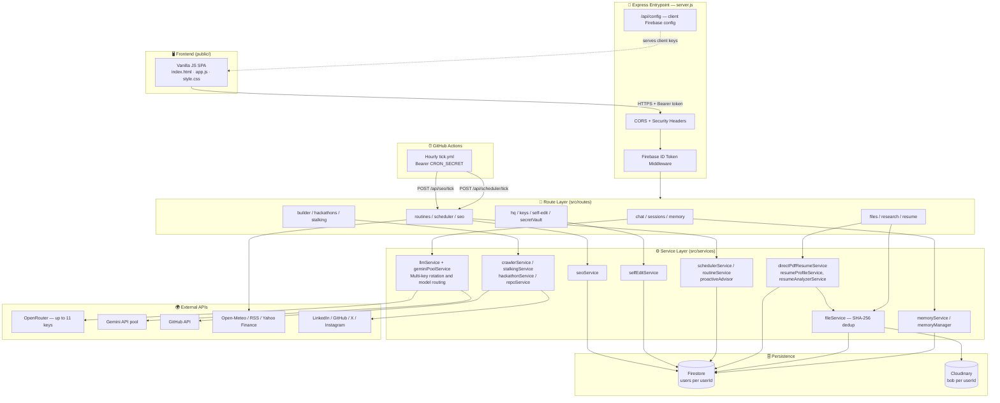
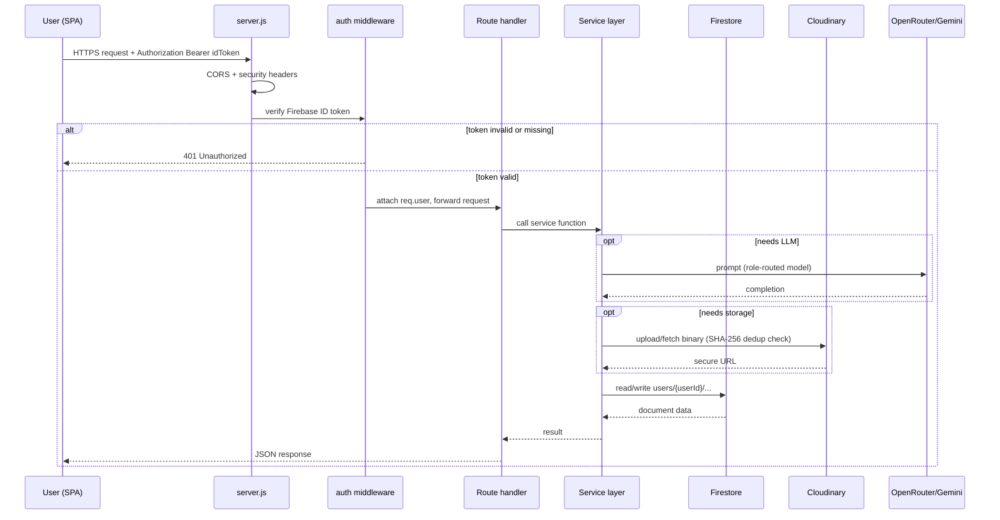
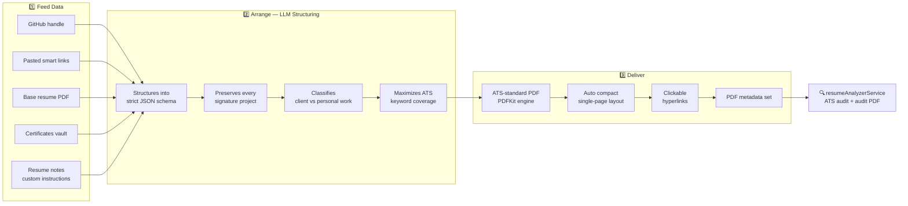
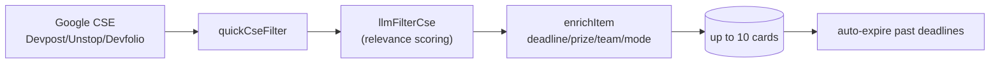
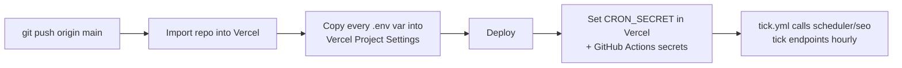

<div align="center">

# 🤖 BOB — Autonomous AI Companion & Engineering System

**One Node.js backend. One master user. Zero compromise.**
LLM orchestration • Structured memory • File vault • AI Resume/ATS engine • Builder workspace • Live intelligence crawlers • Autonomous scheduler • Self-editing • SEO auditor

[](#-prerequisites)
[](#)
[](#)
[](#)
[](#)
[](#-deployment-vercel)
[](#)

</div>

---

> Bob is not a SaaS-template fork. It's a **single-owner, purpose-built personal engineering system** — every module solves a real daily problem: chat with real context, remember everything forever, generate production-grade documents, and build a world-class ATS resume in one click.

## 🧭 Table of Contents

1. [System Overview](#-system-overview)
2. [High-Level Architecture](#%EF%B8%8F-high-level-architecture)
3. [Request Lifecycle](#-request-lifecycle)
4. [Core Capabilities](#-core-capabilities)
5. [Flagship Module — Resume Builder & ATS Engine](#-flagship-module--resume-builder--ats-engine)
6. [Hackathon Radar & Auto-Discovery — Deep Dive](#-hackathon-radar--auto-discovery--deep-dive)
7. [SEO Beast Engine — Deep Dive](#-seo-beast-engine--deep-dive)
8. [Services Reference](#-services-reference)
9. [API Endpoints Reference](#-api-endpoints-reference)
10. [Data Model](#-data-model-firestore)
11. [Getting Started](#-getting-started)
12. [Deployment (Vercel)](#-deployment-vercel)
13. [Security Notes](#-security-notes)
14. [Project Rules](#-project-rules)

---

## 🌐 System Overview

```
bob-backend/
├── src/
│   ├── server.js                      # Express entrypoint, security headers, route mounting
│   ├── config/
│   │   ├── firebase.js                # Firebase Admin init (Auth + Firestore)
│   │   └── cloudinary.js              # Cloudinary storage config
│   ├── middleware/
│   │   └── auth.js                    # Firebase ID token verification (requireAuth)
│   ├── routes/                        # 18 route groups — see API table below
│   └── services/                      # 35+ service modules — business logic layer
├── public/                            # Frontend SPA (HTML5 + vanilla JS + CSS3)
│   ├── index.html
│   ├── app.js
│   └── style.css
├── AI-Website-Engineering-System/     # Reference playbooks Bob the Builder draws on
│   ├── 00-Core-System/                # Workflow, architecture, governance, quality rules
│   ├── 01-Engineering-System/         # Design, frontend, backend, SEO, business, deploy guides
│   ├── 02_Industry_Systems/           # Per-industry site blueprints (SaaS, commerce, etc.)
│   ├── 03_Resource_Libraries/         # Color palettes, font pairings, field taxonomy, stack guide
│   └── 04_Templates/                  # Prompt/brief/progress-report templates
├── AGENTS.md                          # Working rules Bob/agents must follow (git workflow, etc.)
├── .env.example                       # Full environment variable reference
├── vercel.json                        # Vercel serverless deployment config
└── package.json
```

### Design principles

| Principle | What it means |
|---|---|
| 🧍 **Single-owner system** | Every module assumes exactly one master user, so features stay radical and opinionated — no multi-tenant overhead |
| 🔥 **Firestore = single source of truth** | Chat sessions, memory, file metadata, resume profiles, routines, SEO state all live in `users/{userId}/...` |
| ☁️ **Cloudinary for binaries** | PDFs/images/generated docs live in `bob/{userId}/...` with Firestore pointers, protected by SHA-256 dedup |
| 🧩 **Thin routes, fat services** | Routes only parse/respond; every real capability is a unit-testable service in `src/services/` |
| ⏱️ **Cron-by-call** | GitHub Actions calls authenticated "tick" endpoints, so no always-on process is needed on Vercel |

---

## 🏗️ High-Level Architecture



---

## 🔄 Request Lifecycle

Every authenticated call to Bob follows the same guarded path — this is the flow to keep in your head when debugging or extending a route.



---

## ⚡ Core Capabilities

### 1. 💬 Chat & LLM Orchestration
- Multi-key **OpenRouter rotation pool** (up to 11 keys) with automatic failover when a key exhausts credits.
- Role-pinned keys (`BOB_API_KEY`, `CENTER_API_KEY`, `BUILDER_API_KEY`) that survive restarts, plus generic replacement keys.
- Per-task model routing (`WRITER_MODEL`, `REVIEW_MODEL`, `AUDITOR_MODEL`, `VISION_MODEL`, `CHEAP_MODEL`) with automatic capability-based fallback (e.g. shifting off a text-only model when an image is attached, or off a small-context model when the prompt is too big).
- Tool-use / proactive insights layered into `/api/chat`.

### 2. 🧠 Structured Memory Bank
Six long-term memory pillars, all Firestore-backed:

| Pillar | Stores |
|---|---|
| 🎯 Habits & Preferences | workflow, coding style, routines |
| 🧠 Main Memory | general facts, goals, knowledge |
| 🏆 Hackathons | problem statements, teammates, deadlines |
| 🕵️ Stalker Intelligence | target profiles across social platforms |
| 🔒 Secret Vault | PIN-protected credentials/notes |
| 🛠️ Builder & Codebase | architecture notes, tech stack, dev progress |

### 3. 📁 File Vault
- Cloudinary-backed upload/view/download/delete with Firestore metadata sync.
- Automatic text extraction (PDF/DOCX/XLSX/code) so Bob can reference file contents in chat.
- Real binary office file *generation* (`.xlsx`, `.docx`, `.pdf`, `.pptx`) via `documentGenerator`.

### 4. 🛠️ Builder Workspace ("Bob the Builder")
- Dedicated persona with its own key pool and model, isolated from the main chat pool.
- Reads GitHub repos (public, or private with a fine-grained PAT) for self-aware project context.
- Backed by `builderService`, `builderKnowledgeService`, `builderTaskService`, and the `AI-Website-Engineering-System` knowledge base for planning/PRDs/prompt packs.

### 5. 🕵️ Stalker Intelligence & Deep Crawler
- Crawls LinkedIn, GitHub, X, Instagram, and portfolio sites; extracts JSON-LD, tech stack signals, and bios.

### 6. 🏆 Hackathon Radar & Tracker
- Autonomous discovery feeds (Devpost / Unstop / Devfolio) via Google CSE + LLM enrichment, auto-expiry, Live Pulse stats.
- Each hackathon gets its own knowledge doc + strictly-scoped chat. See [deep dive](#-hackathon-radar--auto-discovery--deep-dive).

### 7. ⏰ Autonomous Routines & Scheduler
- Cron-driven (`GET/POST /api/scheduler/tick`, triggered hourly by GitHub Actions) reminders and daily routines, secured via `CRON_SECRET`.
- `proactiveAdvisor` generates notifications on its own from vault/fact changes.

### 8. 🔧 Self-Edit Engine
- Bob can propose and log diffs to its own codebase (`selfEditService`), capped by `SELF_EDIT_MAX_DIFF_CHARS`.

### 9. 📈 SEO Working & Diagnostics
- Crawls **every discoverable page** per site (no artificial cap — only a wall-clock deadline) with sitemap-seeded parallel BFS, broken-link + PageSpeed checks, 4-pillar 100-scale scoring, keyword tracking, honest blocked-site detection, and a **self-healing re-audit pump**.
- Parallel multi-key AI analysis → Hinglish summary, Level-4 action plan, deployable fix plan, full HTML report. See [deep dive](#-seo-beast-engine--deep-dive).

### 10. 📄 AI Resume Builder & ATS Engine *(flagship module — see deep dive below)*

### 11. ⚡ Enhanced File Vault & Multi-File Clipboard System
- **SHA-256 File Deduplication** — every upload generates a content hash; duplicates are instantly reused (`deduplicated: true`) without redundant Cloudinary copies.
- **Multi-File Upload & Clipboard Paste (Ctrl+V)** — up to 10 files, 10MB each, queued directly from clipboard.
- **Multi-Chip Preview UI** — interactive file chips with individual removal and status badges.
- **Multi-Modal Vision & Doc Ingestion** — `/api/chat` handles multiple images/documents in one turn without dropping prior attachments.

---

## 📄 Flagship Module — Resume Builder & ATS Engine

A complete AI-powered resume production pipeline: raw scattered data in → single-page, ATS-optimized, clickable-link PDF out.



### 3.1 Feeding data — no more manual typing
- **GitHub & Coding card** — one input for the GitHub handle, one paste box for profile links. Bob auto-detects each URL and gives it a **clean recruiter-friendly label** (`LeetCode`, `CodeChef`, `Codeforces`, `GitHub`, `LinkedIn`, `DEV.to`, `Portfolio`, …).
- **One sync button**: `🔄 Sync GitHub + Links` — (1) saves your feed to the profile, (2) crawls GitHub repos *and reads their READMEs*, (3) crawls each pasted link for coding stats/badges. Generate does this automatically too.
- **Base resume PDF** — upload your own PDF; Bob extracts contact info, projects, achievements to reuse.
- **Certificates & documents vault** — batch upload marksheets/certs; become direct-viewable Cloudinary links feeding "Certifications & Academics."

### 3.2 Resume Notes — the "teach Bob" power feature

A per-profile **free-text notes box** treated as the highest-priority instruction:

| What you write | What Bob does |
|---|---|
| "The Falcon Tour project mera personal nahi hai — client ke liye freelancing me banaya tha" | Sets that project `client: true`, phrases it as a client-delivered engagement |
| "Smart Attendance System hata do, uski jagah Market Kingdom dal do" | **Replaces** the project in exactly that position |
| "Lemma AWS certificate ko Certifications me add kar do" | **Adds** it as a certification accolade |
| "Summary me 3-liner overview do" | Weaves the overview into the summary |
| "Sirf ye skills dikhao, X mat dikhao" | Overrides skill selection by priority |

Notes persist per profile and are re-sent on every generation.

**Deterministic directive engine** — beyond prompting the LLM, a code-level `applyResumeNotesDirectives` runs *after* generation to guarantee the instructions land: it client-ifies freelance/service work, moves named projects into Experience or Certifications on demand, replaces one project with another at the exact position, and re-adds projects pulled from your profile — so note-based changes are never left to chance (12/12 directive scenarios covered by tests).

### 3.3 The LLM prompt rules Bob lives by
- **Project preservation** — signature projects (`BoB`, `The Falcon Tour`, `Bloom`, `Smart Attendance System`, `Market Kingdom`, or anything in your profile/notes) are never dropped or hallucinated.
- **Hiration / Google-XYZ bullets** — active verb → technical task → quantifiable outcome.
- **Max ATS keyword coverage** — real languages/frameworks/tools woven into titles, tech stacks, bullets.
- **No invented contacts** — email/phone/location only from real profile data.
- **Clean bullet style** — no ending periods, single focus per bullet (modern ATS/Harvard standard).
- **Self-audit & showcase polish (mandatory final pass)** — weak competitive numbers are reframed, never shown as bare lows (e.g. `LeetCode 31 Solved (25 Easy, 6 Medium)` becomes *"Built core DSA fundamentals across arrays, strings, hashing, recursion and two-pointer patterns with 31 LeetCode problems solved"*); every bullet is shaped as **active verb + task + outcome using ONLY real numbers** from the candidate's data.
- **Never invent metrics** — `X%`, `Y users`, `Z concurrent`, `Lighthouse score of X`, `by an estimated X%` placeholders are **forbidden**; a bullet without a real metric closes with a concrete outcome phrase instead. Weak verbs are upgraded (Contributed to / Focused on → Architected / Engineered / Implemented / Designed / Spearheaded). A deterministic `applyShowcasePolish` backstop strips any leaked placeholder clauses from the final JSON.

### 3.4 Rendering the PDF
- **Direct PDFKit engine** (`directPdfResumeService.js`) — streams a valid PDF straight from Node (no external template engine).
- **Smart one-page layout** — renders standard first; auto-rebuilds in a compact layout (tighter margins + smaller fonts) if it overflows.
- **Clickable hyperlinks** — real PDF link annotations with manual underlines, host-name-mapped labels, never overlapping the left column. The header contact bar renders **clean labels only** (`GitHub | LinkedIn | LeetCode | CodeChef`) — the full URL never leaks visually, but each label remains a fully clickable, correctly-typed link annotation.
- **Overlap-proof layout math** — reserved-width wrapping, truncated right-side dates/links, `doc.x` reset after right-aligned draws, "keep inside printable area" checks that add a page before clipping.
- **PDF metadata** — title/author/creator set from candidate name.

### 3.5 Multi-candidate profiles
- **Create** → a `candidate_{slug}_{ts}` profile ("Build for Friend").
- **Switch** → dropdown loads any saved candidate profile fully.
- **Delete** → removes the profile doc **and** its Cloudinary files, but only files not shared with another profile (SHA-256-dedup-aware), reporting removed/kept/failed counts.

### 3.6 ATS auditing
`resumeAnalyzerService` scores bullet quality, keyword coverage, and structure — audit report downloadable as its own PDF.

### 3.7 Resume API surface

| Method | Endpoint | Purpose |
|---|---|---|
| `GET` | `/api/resume/profiles` | List all candidate profiles |
| `GET` | `/api/resume/profile?profileId=` | Load one profile (defaults to `master`) |
| `POST` | `/api/resume/profile?profileId=` | Save/merge profile data |
| `DELETE` | `/api/resume/profile/:profileId` | Delete profile + Cloudinary files (shared-safe) |
| `POST` | `/api/resume/sync/github` | Crawl GitHub repos + README deep-context |
| `DELETE` | `/api/resume/project/:title` | Remove a project by title |
| `POST` | `/api/resume/sync/coding` | Crawl smart links → coding stats/badges |
| `GET` | `/api/resume/smart-links` | Retrieve saved smart links |
| `POST` | `/api/resume/upload/base` | Upload base resume PDF |
| `POST` | `/api/resume/upload/certificate` | Add one certificate record |
| `POST` | `/api/resume/upload/documents` | Batch add documents (+ certificate records) |
| `POST` | `/api/resume/generate` | Generate structured ATS resume data (LLM) |
| `POST` | `/api/resume/download-direct-pdf` | Stream the compiled PDF (PDFKit) |
| `POST` | `/api/resume/analyze` | ATS-audit an uploaded resume file |
| `POST` | `/api/resume/analyze-generated` | ATS-audit the latest generated JSON |
| `POST` | `/api/resume/download-audit-pdf` | Download the audit report as PDF |

---

## 🏆 Hackathon Radar & Auto-Discovery — Deep Dive

Two layers: an **autonomous discovery feed** (`hackathonDiscoveryService`) and a **tracker** (`hackathonService`) where each hackathon is its own object with scoped AI chat.

**Discovery pipeline**


- **Cadence** — auto-discovers roughly every 4 days (`DISCOVERY_INTERVAL_MS`), `MAX_CARDS = 10`, 15s per scrape, enabled/disabled toggle persisted.
- **Live Pulse** — `GET /api/live/pulse` returns `stats { totalDiscovered, active (non-expired), enabled, nextRunAt, lastRunAt }` for the radar card.

**Tracker + scoped chat** — each hackathon stores `knowledge { summary, dates[], prizes[], links[], scrapedAt }`, `participating`, `tracking`, `pastParticipation`, own `chatSessionId`. `refreshKnowledge` re-scrapes (handles login-redirect) and **protects user-set dates** from stale scrape values; pasted announcements can be parsed via `POST /api/hackathons/:id/knowledge-from-text`. Its chat is **strictly scoped** to that hackathon only, auto-detects pasted announcements, and can recover a lost session.

**API surface**

| Method | Endpoint | Purpose |
|---|---|---|
| `GET` | `/api/hackathons` | List tracked hackathons |
| `POST` | `/api/hackathons` | Add hackathon |
| `POST` | `/api/hackathons/parse` | Auto-parse pasted problem statement |
| `GET/PATCH/DELETE` | `/api/hackathons/:id` | Get / update (tracking, dates, notes) / delete |
| `POST` | `/api/hackathons/:id/scrape` | Re-scrape knowledge |
| `POST` | `/api/hackathons/:id/knowledge-from-text` | Inject knowledge from pasted text |
| `GET/POST` | `/api/hackathons/:id/chat` | Scoped hackathon chat |
| `GET` | `/api/live/pulse` | Radar live pulse stats |
| `GET/POST` | `/api/live/hackathon-discovery*` | List / run / save / dismiss / toggle discovery |

---

## 📈 SEO Beast Engine — Deep Dive

A full **parallel, multi-key** SEO auditing stack: crawl → score → AI diagnose → plan → fixed files → HTML report, all self-healing on a cron pump.

**Crawl** (`seoService.runAudit`)
1. **Sitemap-seeded BFS** — seeds the crawl queue from `robots.sitemapUrls` first (same-host filtered, up to the safety cap), then **all** unique homepage internal links. BFS with **12 parallel fetches** (9s each), deduped visited set.
2. **No artificial page cap** — every discovered unique page is crawled until the wall-clock deadline: **90s for a new audit, 110s for a re-audit** (memory-guarded at 10,000 pages). If the deadline hits first, the crawl stops cleanly and reports `crawl.truncated: true`; page details are persisted up to 1,000 entries (`crawledPages`).
3. Per-page on-page audit via Cheerio: title/meta/H1, word count, meta description, h1/dup checks → **thin-content (<120 words)**, **orphan pages**, missing H1/meta, duplicate titles/H1 detection across the crawled set.

**Blocked sites (honest audits)** — if the homepage returns anything other than HTTP 200 (e.g. Cloudflare/nginx bot protection), Bob sets `siteAccessible: false`, shows the real HTTP status, reports a **zero-fabricated score**, skips the crawl and the LLM pass entirely, and returns a deterministic *"site could not be crawled — fix access first, then re-audit"* note. It never scores a 403 error page as if it were the real site, and never invents PageSpeed/CWV numbers for inaccessible domains.

**Scoring** — `score = round((technical + onpage + content + links) / 4)`, each pillar capped at 100; PageSpeed (mobile) fetched for the homepage; broken-link probe (max 6).

**Parallel LLM diagnostics** (`callLLMParallel` → `geminiPoolService.runParallelGemini`)
- `analyzeWithLLM` fans out **one task per issue category** (technical/onpage/content/links) across the Gemini key pool (load-balanced, `concurrencyPerKey = 2`), merges the per-category summaries, keeps ≤6 recommendations. Falls back to single-pass LLM, then deterministic issues-based summary.
- `generateAiActionPlan` uses **3 parallel panelists** — Executive Verdict/Sprint/Architecture — targeting 95/100, joined into one roadmap, persisted next to the audit.
- **Resilience** — per-key in-flight tracking, least-loaded pick, 60s quarantine on 429/quota, model-try chain (`gemma-4-26b-a4b-it` → `gemini-3.6-flash` → `gemini-2.5-flash`), OpenRouter fallback if the whole pool is busy.

**Pump** — `POST /api/seo/pump` (CRON_SECRET or Firebase auth, GitHub Actions ~5-min) runs `processDueReAudits(3)` → up to **3 due sites audited concurrently**, 30-min stall guard, writes `history {score, delta, at}` per site.

**Outputs** — `GET /api/seo/:id/actionplan` (Level-4 plan), `/fixplan` (deployable code), `/report` (self-contained HTML report incl. crawl line), `/chat` (isolated audit-aware chat). Sites tracked per user in `users/{userId}/seoSites`, keywords max 10 per site.

---

## 🔧 Services Reference

| Service | Responsibility |
|---|---|
| `llmService.js` | OpenRouter orchestration, key rotation, model routing/fallback |
| `geminiPoolService.js` | Multi-key Gemini pool — rate-limit/quota rotation, `runParallelGemini` load-balanced parallel dispatch, fallback to OpenRouter |
| `resumeProfileService.js` | Career profile CRUD, GitHub crawler, coding-stats sync, resume parsing, smart-links sync, shared-file-aware deletion |
| `directPdfResumeService.js` | LLM resume structuring + direct PDFKit ATS PDF engine with auto compact single-page layout |
| `resumeAnalyzerService.js` | ATS audit scoring of resumes + audit PDF generation |
| `latexResumeService.js` | Legacy PDF builder (kept for backward compatibility; no longer used for resumes) |
| `fileService.js` | Cloudinary upload/delete with SHA-256 deduplication & Firestore sync |
| `documentReaderService.js` | Extracts text from PDF/DOCX/XLSX/code & zero-token local table query engine |
| `documentGenerator.js` | Generates real `.xlsx/.docx/.pdf/.pptx` files |
| `developerPlatformsService.js` | LeetCode, Codeforces, HackerRank, DEV.to data extraction |
| `memoryService.js` / `memoryManager.js` | Structured facts, monthly memory, notifications |
| `behaviorEngine.js` | Trait/behavior detection from conversation |
| `proactiveAdvisor.js` | Auto-generates proactive notifications |
| `dossierService.js` | Builds deep intelligence dossiers on targets |
| `crawlerService.js` | Generic web page scraping + JSON-LD extraction |
| `repoService.js` | GitHub repo reading for Builder self-awareness |
| `builderService.js` / `builderKnowledgeService.js` / `builderTaskService.js` | Bob the Builder persona logic |
| `selfEditService.js` | Self-edit proposal/diff/history tracking |
| `hackathonService.js` / `hackathonDiscoveryService.js` | Devpost/Unstop/Devfolio scraping + hackathon discovery feeds |
| `stalkingService.js` | Multi-network profile discovery |
| `instagramService.js` / `youtubeService.js` | Platform-specific scraping / transcripts |
| `mediaDetector.js` | Detects media type/links in content |
| `weatherService.js` / `newsService.js` / `stocksService.js` | Live data (Open-Meteo, RSS, Yahoo Finance) |
| `webSearchService.js` | General web search for research |
| `seoService.js` | Site SEO auditing (cap-free parallel crawl — every discovered page within a time deadline, 4-pillar scoring, parallel multi-key LLM analysis/action plan/fix report) |
| `routineService.js` / `schedulerService.js` | Daily routines and cron-driven tasks |
| `statsService.js` | Usage/stat aggregation |

---

## 📡 API Endpoints Reference

All `/api/*` routes (except `/api/health` and `/api/config`) require:
`Authorization: Bearer <firebase-id-token>` (or `?token=` query param for direct browser viewing).

| Route prefix | File | Purpose |
|---|---|---|
| `POST /api/auth/set-password` | `server.js` | Set/reset password for an allow-listed email, returns custom token |
| `/api/chat` | `chat.js` | LLM chat, tool-use, streaming |
| `/api/sessions` | `sessions.js` | Chat sessions + message history |
| `/api/memory` | `memory.js` | CRUD for structured facts/memory |
| `/api/files` | `files.js` | Upload / view / download / delete / generate office files |
| `/api/research` | `research.js` | Crawl & LLM-analyze any URL |
| `/api/secret` | `secretVault.js` | PIN-protected vault |
| `/api/notifications` | `notifications.js` | List/mark-read proactive notifications |
| `/api/scheduler` | `scheduler.js` | Cron tick, reminders |
| `/api/live` | `live.js` | Weather / news / stocks + Hackathon Radar pulse |
| `/api/builder` | `builder.js` | Bob the Builder workspace |
| `/api/hackathons` | `hackathons.js` | Hackathon tracker + parse/scrape/knowledge/chat |
| `/api/dossier`, `/api/stalking` | `stalking.js` | Profile list + deep crawl |
| `/api/routines` | `routines.js` | Daily autonomous routines |
| `/api/hq` | `hq.js` | Aggregated dashboard summary |
| `/api/self-edit` | `selfEdit.js` | Self-edit history/diffs |
| `/api/keys` | `keys.js` | Anonymized OpenRouter key health (raw keys never exposed) |
| `/api/seo` | `seo.js` | SEO audit (cap-free crawl of every discovered page, keyword tracking, action plan, fix plan, HTML report, isolated chat) |
| `/api/resume` | `resume.js` | AI Resume Builder & ATS Engine — see [§ Resume API surface](#37-resume-api-surface) |

---

## 🗄️ Data Model (Firestore)

```
users/{userId}/
├── resume_profile/{profileId}     # personal, education, experience, projects[],
│                                   # skills{}, codingHandles, codingStats,
│                                   # certifications[], baseResume, githubProjects[],
│                                   # smartLinks[], resumeNotes, profileName, updatedAt
├── sessions/{sessionId}            # chat sessions + message history
├── memory/...                      # 6 memory pillars
├── files/{fileId}                  # Cloudinary pointer + SHA-256 hash + metadata
├── routines/...                    # autonomous daily routines
├── notifications/...                # proactive advisor output
└── seo_sites/...                   # tracked sites + audit history
```

---

## 🚀 Getting Started

### Prerequisites
- Node.js 18+ (20+ recommended)
- Firebase project (Auth + Firestore enabled)
- Cloudinary account
- At least one OpenRouter API key (Gemini keys optional — `geminiPoolService` falls back to OpenRouter)

### Installation
```bash
git clone https://github.com/nikhilrawat2005/BoB.git
cd bob-backend
npm install
cp .env.example .env
```

### Environment Configuration
Fill in `.env` — key sections (see `.env.example` for full inline docs):

```env
# OpenRouter — up to 11 rotating keys, optional role pinning
OPENROUTER_API_KEY1=sk-or-v1-...
BOB_API_KEY=
CENTER_API_KEY=
BUILDER_API_KEY1=
BUILDER_MODEL=deepseek/deepseek-chat-v3

# Model routing
WRITER_MODEL=google/gemini-2.5-flash-lite
REVIEW_MODEL=google/gemini-2.5-flash
VISION_MODEL=google/gemini-2.5-flash-lite
CHEAP_MODEL=google/gemini-2.5-flash-lite

# Gemini pool (optional — used for resume intelligence, falls back to OpenRouter)
GEMINI_API_KEY1=

# Firebase Admin
FIREBASE_PROJECT_ID=
FIREBASE_CLIENT_EMAIL=
FIREBASE_PRIVATE_KEY=

# Firebase Client (served via /api/config)
FIREBASE_CLIENT_API_KEY=
FIREBASE_AUTH_DOMAIN=
FIREBASE_STORAGE_BUCKET=
FIREBASE_MESSAGING_SENDER_ID=
FIREBASE_APP_ID=

# Cloudinary
CLOUDINARY_CLOUD_NAME=
CLOUDINARY_API_KEY=
CLOUDINARY_API_SECRET=

# Access control
ALLOWED_EMAILS=you@example.com
SHARED_ADMIN_ID=nikhil_master_workspace
SECRET_VAULT_PIN=2005

# Cron (GitHub Actions -> scheduler/seo tick)
CRON_SECRET=

# Live data
DEFAULT_CITY=New Delhi
```

> 🔴 **Never** put real values in `.env.example` or commit `.env`. Both are placeholders by design — see [Security Notes](#-security-notes).

### Running Locally
```bash
npm run dev     # nodemon, auto-restart
npm start       # plain node
```
Visit `http://localhost:3000`.

> 📝 The app is fully functional without `FIREBASE_PROJECT_ID` for pure-logic services in dev (the resume PDF engine runs offline). Serverless deployment needs real Firebase/Cloudinary keys.

---

## 🚢 Deployment (Vercel)



> ⚠️ On serverless (Vercel) the in-memory OpenRouter key pool is per-instance; prefer role-pinned keys that persist across restarts, and keep function memory/timeout settings generous for PDF generation + LLM calls.

---

## 🔐 Security Notes

- **Never commit `.env` or any service-account JSON** (e.g. `*-firebase-adminsdk-*.json`) — only `.env.example` with placeholder values belongs in git. If a real key ever lands in a commit or a shared zip, treat it as compromised: rotate it immediately in Firebase Console → Project Settings → Service Accounts.
- `ALLOWED_EMAILS` is the single gate for `/api/auth/set-password` — keep it tight.
- `/api/keys` reports OpenRouter key **health only**, never raw key values.
- `CRON_SECRET` protects scheduler/SEO tick endpoints from being called by anyone but your own GitHub Actions workflow.
- `SECRET_VAULT_PIN` gates the Secret Vault feature — treat it like any other credential, not a toy default.

---

## 📜 Project Rules

See `AGENTS.md` for the full working agreement. Summary:
- Commit after every set of changes, push to `origin/main` automatically.
- Never commit secrets or the local `.env` (only `.env.example`).
- Keep reference playbooks in `AI-Website-Engineering-System/`; agents read them before building.

---

<div align="center">

**Built for one master user. Engineered like production.**

</div>
